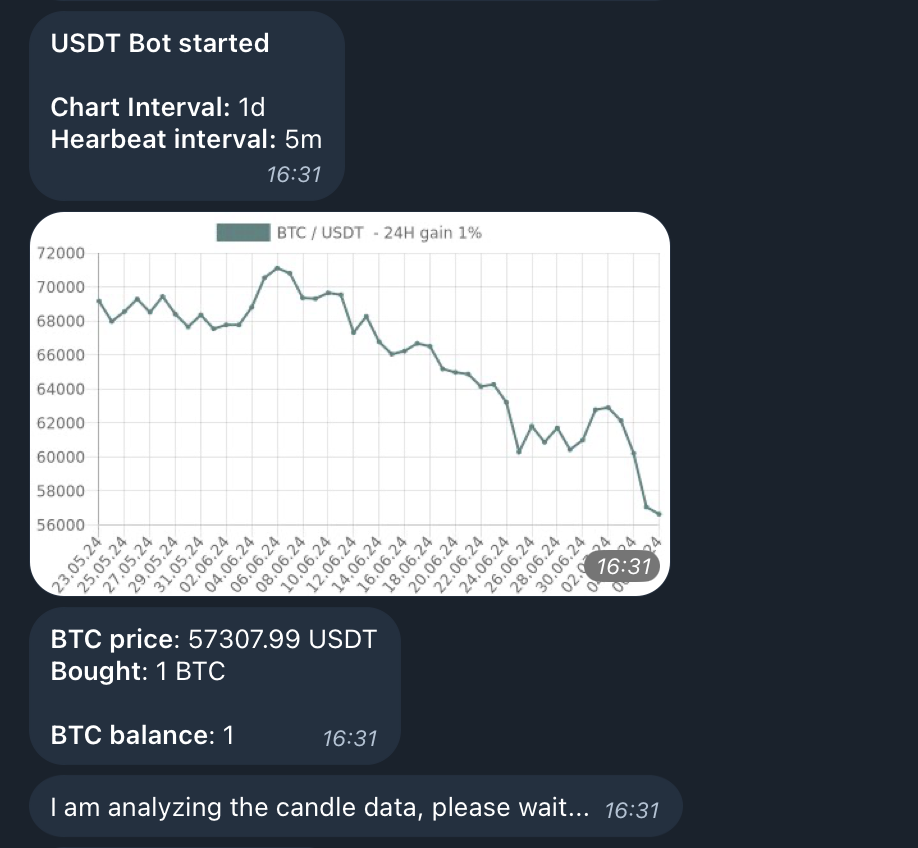

# Binance Service

Binance service is a class with methods for fetching trading information, executing trade and managing both test and real trading enviroments. It's designed to facilitate both gathering market insights via Binance API while also allows test and real live trading based on signals 



## Methods

Here is a list of methods available in the BinanceService class along with brief descriptions:

| Method                        | Description                                                                                                  |
|-------------------------------  |--------------------------------------------------------------------------------------------------------------|
| `getExchangeInfoFromBinance`   | Fetches general information from Binance about available trading pairs, fees, and limits.                |
| `getTradingTickersFromBinance` | Retrieves the latest trading ticker information for all pairs from Binance, including prices and volume.   |
| `getLastPriceOfTicker`        | Obtains the last traded price for a specific ticker from Binance.                                          |
| `getPreviousDaysPriceData`    | Gets the previous day's trading data for a specific pair from Binance, including OHLC prices and volume.   |
| `getBalanceOfAssetOnBinance`   | Fetches the balance of a specific asset in the Binance account.                                            |
| `getTradingHistoryFromBinance` | Retrieves historical trading data from Binance, including past trades made by the account.                  |
| `getCandleStickDataFromBinance` | Obtains candlestick (OHLC) data for a trading pair over a specified interval from Binance.                  |
| `getBinanceAccountBalances`    | Fetches the current balance of all assets in the Binance account.                                          |
| `executeMarketBuy`            | Places a market buy order for a specific trading pair on Binance.                                           |
| `executeMarketSell`           | Places a market sell order for a specific trading pair on Binance.                                          |
| `calculateOrderQuantity`      | Calculates the quantity of asset to trade based on account balance and other parameters.                   |
| `processChartData`            | Prepares data for charting, typically by formatting or aggregating raw data.                                |
| `drawChartImage`              | Generates and displays a chart image based on prepared data, visualizing trading information.               |
| `formatDate`                   | Formats a date into a specific string format for display or logging.                                        |
| `parseInterval`               | Parses a time interval string and converts it into a usable format (e.g., "1h" to a numerical value).       |
| `determineHeartbeatIntervalMs` | Retrieves the interval at which the system sends heartbeat signals to ensure connectivity and operation.     |
| `useDumpTradeSignal`          | Logs or outputs a trade signal, typically for debugging or analysis purposes.                               |
| `usePumpTradeSignal`         | Processes a trade signal indicating an upward trend or buy opportunity.                                     |
| `useFlatTradeSignal`         | Processes a trade signal indicating a neutral trend or no significant movement.                             |
| `useSimpleTradeSignal`       | Processes a basic trade signal, potentially combining other signal types or using a simplified strategy.    |
| `runTestMode`                 | Initiates test mode for simulated trading without real transactions.                                         |
| `startTestServer`             | Starts a server for handling test mode operations, including simulated market data.                         |
| `startTestLoop`               | Begins the main loop for test mode, managing simulated trading operations and events.                       |
| `testHeartBeatLoop`          | Runs a heartbeat loop during test mode to maintain connectivity and proper operation.                       |
| `startReal`                   | Initiates real trading mode, enabling live trading operations with actual market data and funds.            |
| `startRealServer`            | Starts a server for handling real trading operations, including live market data and order execution.       |
| `getStartupBalances`         | Retrieves account balances at startup to establish initial conditions for trading operations.               |
| `startRealLoop`              | Begins the main loop for real trading, managing live trading operations and events.                         |
| `realHeartBeatLoop`         | Runs a heartbeat loop during real trading to ensure connectivity and proper operation.                      |
| `getAccountBalances`        | Fetches the current balances of assets in the account, similar to `getBinanceAccountBalances`.              |
| `sendTelegramMessage`       | Sends a message via Telegram for notifications or logging purposes.                                          |
| `delay`                      | Introduces a delay for a specified amount of time, useful for rate-limiting or timing operations.            |

## Example
```javascript
import binanceService from "./BinanceService"; 
const binanceService = new BinanceService(); 
binanceService.runTestMode() // start in test mode, with fake buys and sells. 
binanceService.startReal() // start in real mode, with real buys and sells etc. 
```

## Env
```yaml
TEST_MODE=true
MODE=DEVELOPMENT
BINANCE_APIKEY=<YOUR_BINANCE_APIKEY>
BINANCE_APISECRET=<YOUR_BINANCE_APISECRET>
USE_TELEGRAM=false
TELEGRAM_ACCESS_TOKEN=<YOUR_TELEGRAM_ACCESS_TOKEN>
TELEGRAM_CHANNEL_ID=<YOUR_TELEGRAM_CHANNEL_ID>
INDICATOR=pump
INDICATOR_CHANGE_PERCENT=10
DELAY=1000
HEARTBEAT_INTERVAL=1m
NEXT_TRADE_DELAY=30s
PRIMARY_SYMBOL=BTC
SECONDARY_SYMBOL=USDT
TEST_COMISSION_PERCENT=0.01
USE_FIXED_TRADE_VALUE=true
FIXED_TRADE_VALUE=20
FIXED_TRADE_PERCENT=10
MIN_TRADE_USD_VALUE=10
MIN_CHANGE_PERCENT=20
```